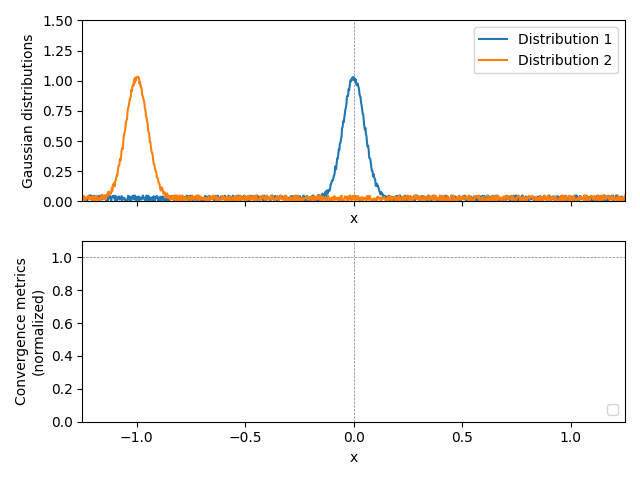

# earth_mover_distance_example
Example of the [earth mover distance](https://en.wikipedia.org/wiki/Earth_mover%27s_distance) algorithm

Below, I perform an example one-dimensional EMD analysis on two Gaussian distributions with noise added.  The first is centered at x=0, and the second is slowly shifted from x=-1 to x=1.   The minimum in the EMD occurs when the two overlap.

I've included two other convergence metrics: The [L2-norm](https://mathworld.wolfram.com/L2-Norm.html) and [1-R^2](https://en.wikipedia.org/wiki/Coefficient_of_determination#As_squared_correlation_coefficient).  While all three metrics converge to zero at x=0, only the EMD metric shows a consistent downward trajectory while approaching x=0.  The argument here is that EMD is better suited (in terms of accuracy but not necessarily speed) for a gradient descent regression or similar convergence scheme.  

